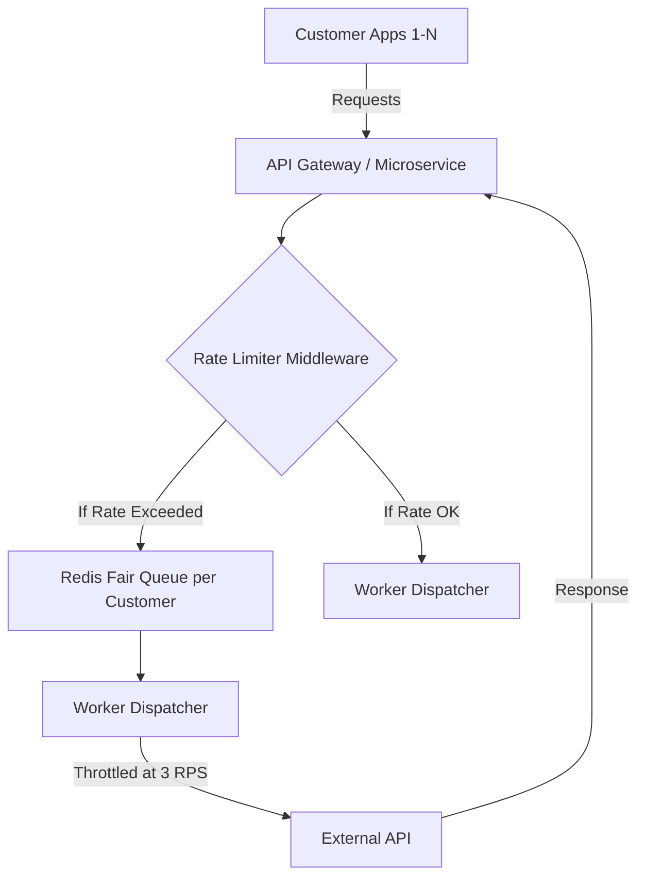

# Symplichain Technologies - Software Engineering Intern Hackathon
**Candidate:** [Your Name]
**Date:** April 7, 2026

---

## Part 1: Shared Gateway Problem – Request Pooling & Throttling

### 1. Problem Definition
- **Capacity:** 3 requests per second (RPS) hard limit globally.
- **Demand:** Peak load > 20 RPS from 25+ customers.
- **Constraint:** Fairness required (single customer shouldn't starve others).

### 2. Proposed Architecture
I propose a **Distributed Token Bucket Governor** system backed by **Redis**.



#### Why Redis?
- **Atomic Operations:** `INCR` and `EXPIRE` allow us to build high-performance rate limiters without race conditions.
- **Persistence:** In-flight queues survive temporary service crashes.

### 3. Rate Enforcement: Guaranteeing ≤ 3 per second
I would implement a **Global Token Bucket** in Redis.
- A "governor" script (running in Celery or a lightweight Go service) replenishes a Redis key with "tokens" at a rate of 3 per second, up to a max burst of 3.
- Before calling the External API, a worker must `DECR` the token count. If it's 0, it must Wait/Retry.

### 4. Fairness Strategy: Weighted Fair Queuing (WFQ) 
To prevent "Customer A" from blocking "Customer B":
1. **Per-Customer Queues:** Each customer gets their own Redis list (queue).
2. **Round-Robin Dispatcher:** The dispatcher pops one request from Customer A, then one from B, then one from C. 
3. **Yielding:** If Customer A has 100 requests and Customer B has 1, the dispatcher will call B's request immediately after A's first request, rather than waiting for all 100.

### 5. Failure Handling: Retry Strategy
If the external API returns a `5xx` or `429`:
- **Exponential Backoff:** Start with 1s, then 2s, 4s, 8s.
- **Jitter:** Add random noise (±100ms) to prevent "thundering herd" if multiple instances retried at the exact same time.
- **Circuit Breaker:** If failure rate > 50% over 1 min, "open" the circuit and fail fast locally to give the external service time to recover.

---

## Part 2: Mobile Architecture – SymFlow App

### 1. Interaction Model: "AI-First / Natural Language"
In supply chain management, users are often on the move or in noisy environments.
- **Primary:** Natural Language Input ("Where is the shipment to Bangalore?") + Voice-to-Text.
- **Secondary:** Fluid, Click-based Dashboard for quick status overrides.
- **Critical Feature:** "One-Tap Actions" (Barcode scanning, POD photo capture) should be reachable in < 2 steps.

### 2. Tech Stack: React Native
**Choice:** React Native + TypeScript.
**Reasoning:**
- **Code Reuse:** Symplichain already uses React for the web. 80-90% of business logic, types, and API hooks can be shared.
- **Performance:** For a logistics app (mostly forms, maps, and lists), React Native provides the native 60FPS feel without the overhead of dual-platform Swift/Kotlin teams.
- **Integration:** Excellent libraries for AWS Bedrock (via Amplify/SDK) and camera access.

---

## Part 3: CI/CD and Deployment Pipeline

### 1. The Strategy: Automated SSH & S3 Sync
The current semi-manual process is prone to human error. I've designed two GitHub Actions workflows (`staging.yml` and `production.yml`) to automate the "Git push -> Deploy" cycle.

**Staging Workflow (`staging.yml`):**
```yaml
name: Deploy to Staging

on:
  push:
    branches: [ "staging" ]

jobs:
  deploy-backend:
    runs-on: ubuntu-latest
    steps:
      - uses: actions/checkout@v3

      - name: Deploy to EC2
        uses: appleboy/ssh-action@v0.1.10
        with:
          host: ${{ secrets.STAGING_EC2_HOST }}
          username: ubuntu
          key: ${{ secrets.SSH_PRIVATE_KEY }}
          script: |
            cd /home/ubuntu/symflow
            git pull origin staging
            source venv/bin/activate
            pip install -r requirements.txt
            python manage.py migrate
            python manage.py collectstatic --noinput
            sudo systemctl restart gunicorn

  deploy-frontend:
    runs-on: ubuntu-latest
    steps:
      - uses: actions/checkout@v3

      - name: Install dependencies
        run: npm install

      - name: Build
        run: npm run build

      - name: Sync to S3
        env:
          AWS_ACCESS_KEY_ID: ${{ secrets.AWS_ACCESS_KEY_ID }}
          AWS_SECRET_ACCESS_KEY: ${{ secrets.AWS_SECRET_ACCESS_KEY }}
        run: |
          aws s3 sync dist/ s3://${{ secrets.STAGING_S3_BUCKET }} --delete
          aws cloudfront create-invalidation --distribution-id ${{ secrets.STAGING_CF_DIST_ID }} --paths "/*"
```

### 2. Conceptual Improvements: Docker & Terraform

#### **Why Docker?** 🐳
Currently, each EC2 instance is a "pet"—meaning it requires manual setup of Python, libraries, and system dependencies. This leads to configuration drift. Docker solves this by:
- **Reproducibility:** A single container image runs identically on a developer's laptop, the Staging EC2, and Production EC2.
- **Zero-Downtime:** Using tools like Docker Swarm or Kubernetes (or even blue-green with Nginx) becomes trivial.

#### **Why Terraform?** 🏗️
Terraform replaces manual clicking in the AWS Console. It gives us:
- **Disaster Recovery:** If an RDS instance is accidentally deleted, we can recreate it in minutes using `terraform apply`.
- **Infrastructure Parity:** We can clone the entire Production stack into a "Staging-2" environment instantly for testing complex updates.

---

## Part 4: Debugging – The Monday Morning Outage

**Scenario:** POD photo uploads failing.

### Step 1: Check AWS CloudWatch Logs (The Gateway)
- **Action:** Look for `502 Bad Gateway` or `504 Gateway Timeout` errors in CloudWatch. 
- **Reason:** Is the request even hitting our Django server, or is Nginx/ALB blocking it?
- **Command/Dashboard:** CloudWatch Logs -> Log Groups -> `/aws/lambda/symflow-api` or EC2 logs.

### Step 2: Check S3 Upload Status
- **Action:** Verify if the files are physically appearing in the S3 bucket.
- **Reason:** If files are missing, the driver-to-API link is broken (likely network or S3 IAM permissions). If they are there, the failure is downstream in Celery.
- **Command:** `aws s3 ls s3://pod-uploads-bucket/pending/`

### Step 3: Check Celery Flower / Worker Logs
- **Action:** Check "Success/Failure" rates in Flower dashboard.
- **Reason:** The prompt says "Celery task triggered." If the task is in `RETRY` or `FAILURE`, we can see the exact traceback (e.g., `Bedrock access denied` or `Model timeout`).

### Step 4: Validate AWS Bedrock Limits
- **Action:** Check AWS Service Quotas for Bedrock.
- **Reason:** Monday 9 AM = High Volume. We might be hitting the "On-Demand" throughput limit for the model, causing the validation to fail.

### Step 5: RDS Connection Pool
- **Action:** Check RDS Monitoring in AWS Console.
- **Reason:** If the worker can't write the result, the task fails. Look for "Total Connections" spikes or "Storage Full" alerts (common on Monday mornings after weekend logs accumulate).

---

**End of Submission**
